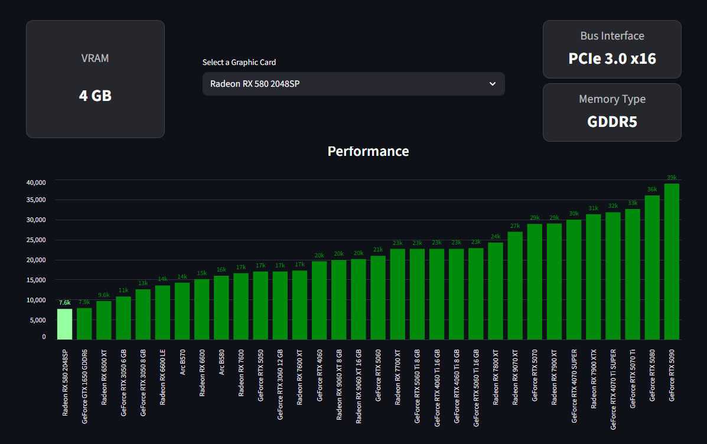

# Graphics Card Dashboard

A dashboard for comparing graphics cards performance and prices.

## 🔗 Live Demo

**[View Dashboard on Streamlit Cloud](https://videocard-dashboard.streamlit.app)**

## Features

- 📊 Performance chart with PassMark G3D scores
- 💰 Price comparison chart (in R$)
- 🗂️ Information cards displaying VRAM, Price, Bus Interface, and Memory Type
- 📋 Dropdown to select and highlight specific graphics card models
- 📈 Interactive visualization with tooltips

## Tech Stack

- Python
- Streamlit
- Pandas
- Altair

## Data

GPU data is stored in `data/video_cards.csv` with the following fields:
- `gpu_model_name` - GPU model name
- `vram` - Video RAM
- `memory_type` - Memory type (GDDR5, GDDR6, etc.)
- `bus_interface` - PCIe interface
- `passmark_g3d_score` - PassMark G3D benchmark score
- `price` - Price in Brazilian Reais (R$)

## License

MIT
