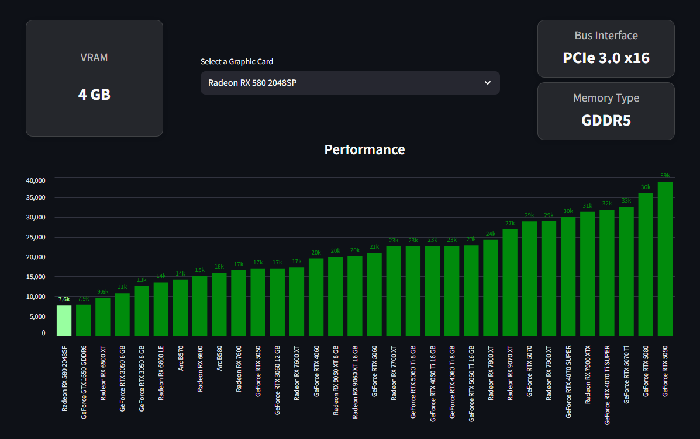

# Graphics Card Dashboard

This is a dashboard for graphics cards, designed to analyze the performance of each card and display detailed specifications.



This project was built using the following technologies:

- Python
- Streamlit
- Pandas
- Altair
- SQLite

## Features

- 📊 Performance chart with PassMark G3D scores
- 🗂️ Information cards displaying VRAM, Bus Interface, and Memory Type
- 📋 Dropdown list to select and highlight specific graphics card models
- 📈 Interactive visualization with tooltips
- 🗄️ SQL database for graphics card data storage

## Setup

### Prerequisites
- Python 3.7+
- MySQL Server installed and running

### Installation

1. **Clone the repository**
   ```bash
   git clone https://github.com/aikoandre/VideoCard_Dashboard.git
   cd VideoCard_Dashboard
   ```

2. **Install Python dependencies**
   ```bash
   pip install -r requirements.txt
   ```

3. **Set up the MySQL database**
   
   a. Make sure MySQL is running on your system
   
   b. Create the database and tables:
   ```bash
   mysql -u root -p < sql/schema.sql
   ```
   Or manually run the SQL commands from `sql/schema.sql` in your MySQL client.

4. **Configure database credentials**
   
   a. Copy `.env.example` to `.env`:
   ```bash
   cp .env.example .env
   ```
   
   b. Edit `.env` and update with your MySQL credentials:
   ```
   DB_HOST=localhost
   DB_USER=root
   DB_PASSWORD=your_mysql_password
   DB_NAME=gpu_dashboard
   ```

5. **Populate the database (optional)**
   
   Use the scripts in the `scripts/` folder to fetch and populate graphics card data:
   ```bash
   python scripts/update_tpu_specs.py
   python scripts/update_passmark_scores.py
   ```

6. **Run the dashboard**
   ```bash
   streamlit run src/app.py
   ```

The dashboard should now be running at `http://localhost:8501`
